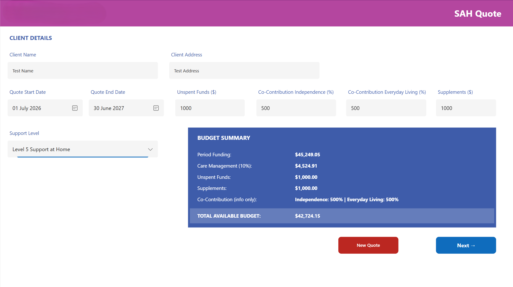
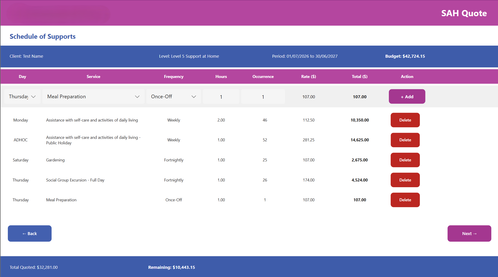
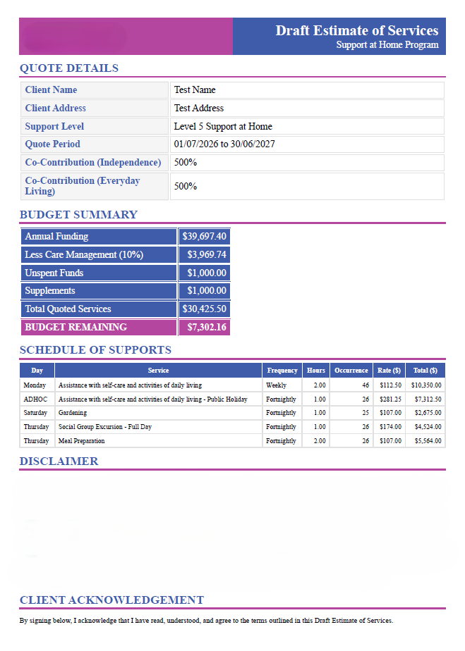

# SaH Budget & Quote Generator - Power Apps Solution

A custom Power Apps application that calculates available client budget funds and generates professional, branded quotes — replacing an inconsistent, manual quoting process with a standardised, self-service tool for non-technical staff. Built entirely on free-tier Microsoft 365 licensing, with no premium connectors.

The same architecture was later reused to build two related variants for different funding programs, proving the design as a reusable "build once, adapt" pattern rather than a one-off.

---

## The Problem

There was no standardised way to calculate available budget against quoted services. Quotes were built ad hoc, which led to inconsistencies between staff, slow turnaround for clients waiting on quotes, and no reliable, real-time view of remaining funds as services were added to a quote.

## The Solution

I designed and built an end-to-end Power Apps application that lets non-technical staff manage the full quoting workflow themselves — from entering client and funding details, through building a service schedule, to generating a client-ready branded document — without touching a spreadsheet or doing manual calculations.

### App structure

A three-screen Power Apps canvas app:

- **Client & Budget Setup** - captures client details, quote period, support/funding tier, and funding adjustments (carried-over unspent funds, supplementary amounts, co-contribution percentages). Shows a live "Total Available Budget" before any services are added.
- **Service Line Builder** - the core data-entry screen. A dropdown-driven entry row feeds an in-memory collection rendered as a scrollable, editable list. A running summary bar shows total quoted, remaining budget, and a visual over-budget warning.
- **Quote Summary & Generation** - a read-only recap of client details, budget summary, and all service lines, with a one-click "Generate Quote" action and a "New Quote" reset.

### Data model

Three SharePoint lists act as lightweight reference tables — deliberately using soft, in-memory matching rather than SharePoint lookup columns, to avoid known Power Apps/SharePoint relationship quirks:

- **Services/Rates** - billable service line items, with rate, category, a fixed-price flag, and a day-type classification (e.g. weekday/weekend/public holiday) used to filter which services are selectable for a given day.
- **Support Levels** - funding tiers, each with a daily funding rate and an administrative fee percentage.
- **Public Holidays** - a maintained date list used purely for date arithmetic (see below).

### Core logic

**Budget calculation:** period funding is derived from the selected support tier's daily rate × number of days in the quote period, less an administrative fee percentage, plus manual adjustments (carried-over funds, supplements). As service lines are added, their cost is summed and subtracted live to produce a running "Remaining Budget" figure, with a visual warning if it goes negative.

**Automatic occurrence calculation:** rather than having staff manually count how many times a weekly/fortnightly service falls within an arbitrary date range, the app calculates this automatically — finding the first matching weekday on/after the start date, counting recurrences at the correct interval through to the end date, adjusting for an edge case where the start date itself falls on the target weekday, and subtracting any public holidays on that weekday (since holiday visits are billed as a separate line). The occurrence figure is left editable rather than locked, since staff occasionally need to override it for one-off cases.

**Day-based filtering:** the service dropdown filters its options based on the selected day, using the day-type classification on the rate table — preventing staff from accidentally selecting a weekend-rate service for a weekday visit, with an "any day" option for one-off entries.

### Quote generation - the interesting engineering problem

This went through several iterations before landing on a solution that worked entirely within free-tier licensing:

1. **First attempt:** using Power Automate's "populate a Word template" action — abandoned when it turned out to require a premium connector not included in the available licence tier.
2. **Second attempt:** generating the document as a data-URI HTML string and opening it directly via the app's `Launch()` function — failed because the resulting URL exceeded platform length limits once a fully styled document was embedded.
3. **Final solution:** the app constructs a complete, fully inline-styled HTML document as a single string within a Power Fx formula (no `<style>` blocks, since Power Apps strips them on render) — branded header, client and budget tables, a dynamically generated service-line table built with `Concat()` over the in-memory collection, and a signature block. This string is passed to a small Power Automate flow (triggered directly from the app) that simply saves it as a file in a SharePoint document library, using only the standard SharePoint connector. The app then builds the direct file URL in a format that triggers a browser download, and opens it via `Launch()` — with a short "please wait" notification to cover the brief delay between the flow completing and the file being available, avoiding a race condition.

### Architecture overview

```
Staff enters client + funding details (Screen 1)
        │
        ▼
Live budget calculation (support tier rate × period − fees + adjustments)
        │
        ▼
Staff builds service schedule (Screen 2)
        │   — day-filtered service picker
        │   — auto-calculated occurrences (date logic + holiday exclusions)
        │   — running total vs. remaining budget
        ▼
Quote Summary screen — read-only recap (Screen 3)
        │
        ▼
"Generate Quote" → inline-styled HTML built in Power Fx
        │
        ▼
Power Automate flow → saves HTML file to SharePoint (standard connector only)
        │
        ▼
App opens file via direct download URL (Launch())
```


## Engineering challenges solved

- Worked around a premium-connector licensing restriction by moving document generation from a Word-template approach to an in-app HTML string, avoiding additional licensing cost entirely.
- Solved a browser URL-length limitation by switching from a data-URI approach to a "save via flow, then launch the saved file" pattern.
- Diagnosed and fixed a file-availability race condition between the flow saving the document and the app attempting to open it.
- Fixed an off-by-one edge case in the weekly/fortnightly occurrence calculation when the start date itself fell on the target weekday.
- Traced an apparent timezone/date-mismatch bug back to its actual root cause (an incomplete reference data range, not a UTC offset issue) using direct on-screen debugging rather than assuming the first plausible explanation.
- Standardised on plain text SharePoint columns after repeated type-mismatch errors caused by Choice-column `.Value` comparison quirks.
- Re-used the full architecture to build two further variants of the tool for different funding programs, validating the design as a genuinely reusable pattern rather than a single-purpose build.

## Impact

- Standardised the quoting process across the team, removing inconsistency from ad hoc manual quoting.
- Improved accuracy by removing manual budget and occurrence calculations.
- Reduced turnaround time from quote request to finished, branded, client-ready document.
- Delivered entirely within existing free-tier Microsoft 365 licensing, with no additional software cost.

## Tech Stack

- **Microsoft Power Apps** (canvas app, Power Fx formulas)
- **Microsoft Power Automate** (lightweight file-save flow, standard connector only)
- **SharePoint** (reference data lists, document storage)
- **HTML/CSS** (inline-styled, dynamically generated quote documents)

## My Role

End-to-end ownership: requirements gathering, data model design, app build, the iterative problem-solving behind the document generation approach, debugging, and handover/training so non-technical staff could operate and maintain the tool independently. Also extended the architecture to build two further variants for related funding programs.

---

*Note: This was built for an employer's internal use, so application code/data isn't published here. This repo documents the problem, architecture, and engineering decisions as a case study. Specific funding figures, rates, and program names have been generalised. Screenshots below show the app in use with all client and financial data blanked out.*

## Screenshots




